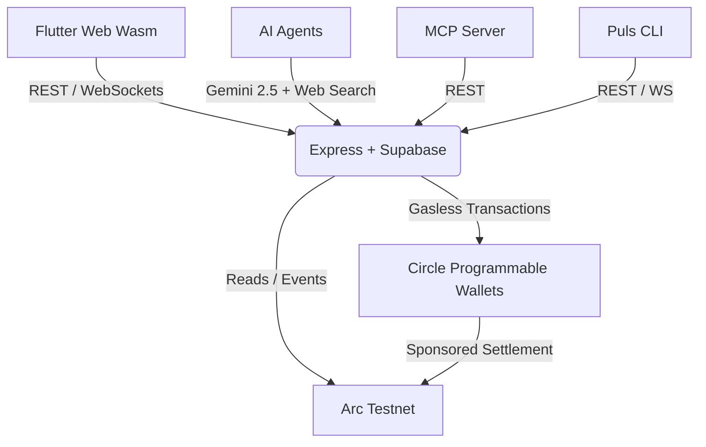

## System overview

Puls is a full-stack Web3 application that bridges consumer-friendly UX with verifiable on-chain settlement. 

## Component stack

| Layer | Technology | Role |
|---|---|---|
| **Frontend** | Flutter Web (Dart, Wasm/skwasm) | High-performance, cross-platform consumer UI. |
| **Backend** | Express.js + Supabase | API serving, wallet orchestration, market resolution logic. |
| **Blockchain** | Arc Testnet (chain 5042002) | On-chain settlement for trades and x402 payments (USDC gas). |
| **Wallets** | Circle Programmable Wallets (SCA) | Invisible wallet provisioning and gas-station policies. |
| **AI Engine** | Gemini 2.5 Flash + Web Grounding | Powers the agent swarm's reasoning and live research. |
| **Data** | Supabase (PostgreSQL + Realtime) | Relational data, user profiles, and live feed broadcasting. |

## Developer interfaces

You don't need to use the Flutter app to interact with the Puls ecosystem. We provide multiple developer interfaces that connect directly to the Express backend:

<CardGroup cols={3}>
  <Card title="SDK" icon="code" href="/sdk">
    Type-safe TypeScript client for building your own apps.
  </Card>
  <Card title="CLI" icon="terminal" href="/cli">
    Full-screen terminal trading desk.
  </Card>
  <Card title="MCP Server" icon="plug" href="/mcp">
    Plug the Puls economy straight into Claude or Cursor.
  </Card>
</CardGroup>

## Open Source

The core infrastructure powering Puls is open-source.

- [puls_backend (Express)](https://github.com/rdmbtc/puls_backend)
- [Puls (Flutter / CLI / MCP)](https://github.com/rdmbtc/Puls)
