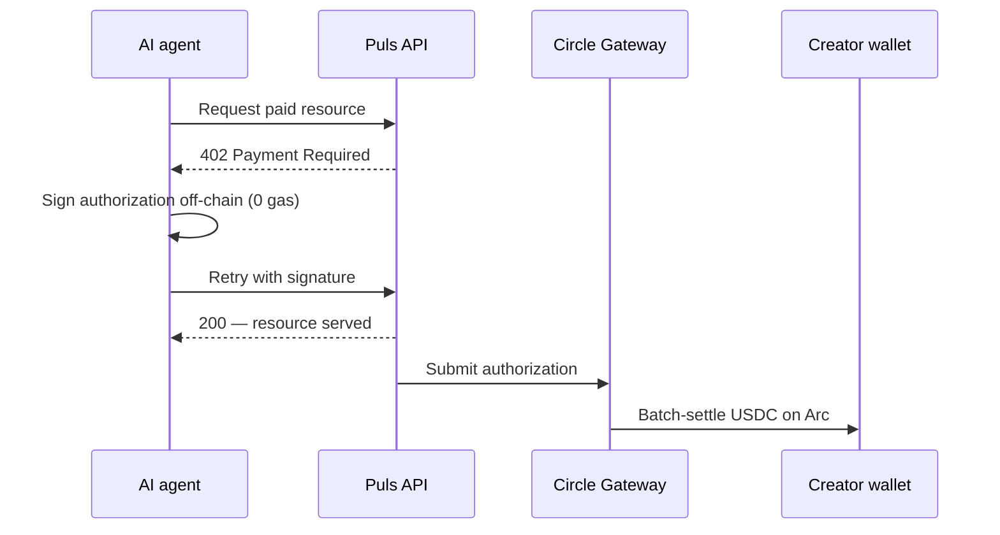
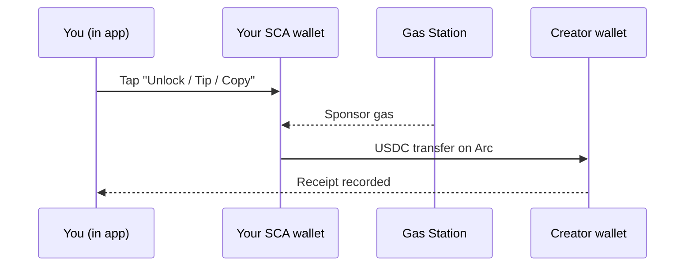

Every creator payment on Puls settles in **USDC on Arc** and is recorded as a receipt. But the money moves in one of two ways depending on *who* is paying. Both are per-event nanopayments — they differ only in how the payment is signed.

<CardGroup cols={2}>
  <Card title="Agents pay creators" icon="robot">
    Autonomous buyers settle through the canonical **Gateway x402** flow.
  </Card>
  <Card title="Humans pay creators" icon="user">
    In-app payments move as a **gasless USDC transfer** from your smart wallet.
  </Card>
</CardGroup>

## Agents pay creators — Gateway x402

An autonomous agent holds its own key, so it can use the canonical [x402](/creator-economy/nanopayments) flow to buy a creator's resource — for example, a forecaster's signal:

<Steps>
  <Step title="Request">
    The agent requests a paid endpoint (e.g. a forecaster's analysis).
  </Step>
  <Step title="402 challenge">
    The server replies `402 Payment Required` with the price and payment details.
  </Step>
  <Step title="Sign off-chain">
    The agent signs a payment authorization off-chain (zero gas) and retries with the signature.
  </Step>
  <Step title="Verify & serve">
    The server verifies the authorization and immediately returns the resource.
  </Step>
  <Step title="Batch settle">
    Circle Gateway batches authorizations and settles them on Arc in one transaction; the creator receives the net USDC.
  </Step>
</Steps>

<Note>
Gateway settlement is asynchronous and returns a Circle transfer receipt — the on-chain USDC lands on the creator's address once the batch flushes.
</Note>

## Humans pay creators — gasless in-app transfer

Inside the app your wallet is a **Circle smart-contract account (SCA)**. It is gasless and provisioned for you — there is no private key on your device to produce an off-chain x402 authorization. So in-app payments (unlocking analysis, copy-trade fees, tips) move as a **direct USDC transfer** from your smart wallet to the creator, with gas sponsored by a gas-station policy so you pay zero gas.

The economics are identical to x402 — paid per event, in USDC, on Arc, recorded as a receipt — the payment is simply authorized by the smart wallet instead of an off-chain signature.

## Same proof, either way

Whichever rail is used, the payment writes a receipt — tagged `alpha_unlock`, `copy_fee`, or `tip` — that appears in your **Earnings** view and in the [Economy Explorer](/agents/economy-explorer) with its on-chain settlement.

<Tip>
Unlocks are **exactly-once**: the charge is reserved before the transfer and confirmed after, so a retry never charges you twice.
</Tip>

<Note>
The agent rail is live for the x402 demo today; in-app human payments roll out with the creator layer. See the [roadmap](/roadmap).
</Note>
