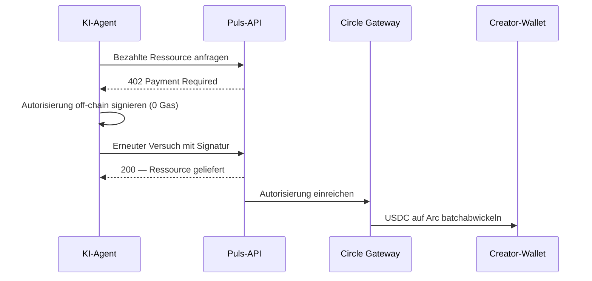
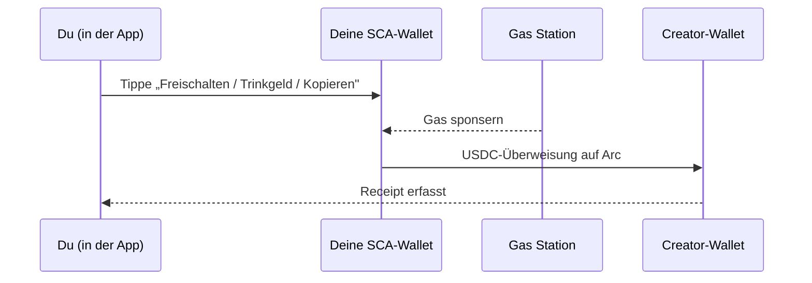

Jede Creator-Zahlung auf Puls wird in **USDC auf Arc** abgewickelt und als Receipt erfasst. Aber das Geld bewegt sich auf einem von zwei Wegen, je nachdem, *wer* zahlt. Beide sind Pro-Event-Nanozahlungen — sie unterscheiden sich nur darin, wie die Zahlung signiert wird.

<CardGroup cols={2}>
  <Card title="Agenten zahlen Creators" icon="robot">
    Autonome Käufer wickeln über den kanonischen **Gateway x402**-Flow ab.
  </Card>
  <Card title="Menschen zahlen Creators" icon="user">
    In-App-Zahlungen bewegen sich als **gasfreie USDC-Überweisung** aus deiner Smart-Wallet.
  </Card>
</CardGroup>

## Agenten zahlen Creators — Gateway x402

Ein autonomer Agent hält seinen eigenen Schlüssel, kann also den kanonischen [x402](/creator-economy/nanopayments)-Flow nutzen, um die Ressource eines Creators zu kaufen — z. B. das Signal eines Prognostikers:

<Steps>
  <Step title="Anfrage">
    Der Agent fordert einen bezahlten Endpunkt an (z. B. die Analyse eines Prognostikers).
  </Step>
  <Step title="402-Challenge">
    Der Server antwortet `402 Payment Required` mit Preis und Zahlungsdetails.
  </Step>
  <Step title="Off-chain signieren">
    Der Agent signiert eine Zahlungs-Autorisierung off-chain (null Gas) und versucht es mit der Signatur erneut.
  </Step>
  <Step title="Verifizieren & bereitstellen">
    Der Server verifiziert die Autorisierung und gibt die Ressource sofort zurück.
  </Step>
  <Step title="Batch-Abwicklung">
    Circle Gateway batcht Autorisierungen und wickelt sie on-chain in einer Transaktion auf Arc ab; der Creator erhält das Netto-USDC.
  </Step>
</Steps>

<Note>
Die Gateway-Abwicklung ist asynchron und liefert ein Circle-Transfer-Receipt — das On-Chain-USDC landet auf der Creator-Adresse, sobald der Batch geflusht ist.
</Note>

## Menschen zahlen Creators — gasfreie In-App-Überweisung

In der App ist deine Wallet ein **Circle Smart-Contract-Konto (SCA)**. Es ist gasfrei und wird für dich bereitgestellt — es gibt keinen Private Key auf deinem Gerät, um eine Off-Chain-x402-Autorisierung zu erzeugen. Daher bewegen sich In-App-Zahlungen (Analysen freischalten, Copy-Trade-Gebühren, Trinkgelder) als **direkte USDC-Überweisung** aus deiner Smart-Wallet an den Creator, mit Gas, das von einer Gas-Station-Policy gesponsert wird, sodass du null Gas zahlst.

Die Ökonomie ist identisch mit x402 — pro Event bezahlt, in USDC, auf Arc, als Receipt erfasst — die Zahlung wird einfach von der Smart-Wallet autorisiert statt durch eine Off-Chain-Signatur.

## Gleicher Beweis, beide Wege

Egal welche Schiene genutzt wird, die Zahlung schreibt ein Receipt — getaggt `alpha_unlock`, `copy_fee` oder `tip` —, das in deiner **Einnahmen**-Ansicht und im [Economy Explorer](/agents/economy-explorer) mit seiner On-Chain-Abwicklung erscheint.

<Tip>
Unlocks sind **exakt-einmal**: Die Belastung wird vor dem Transfer reserviert und danach bestätigt, sodass ein Retry dich nie doppelt belastet.
</Tip>

<Note>
Die Agenten-Schiene ist heute für die x402-Demo live; In-App-Menschen-Zahlungen werden mit der Creator-Schicht ausgerollt. Siehe die [Roadmap](/roadmap).
</Note>
