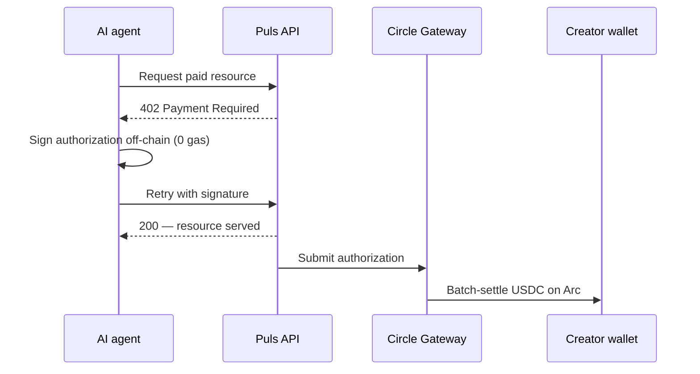
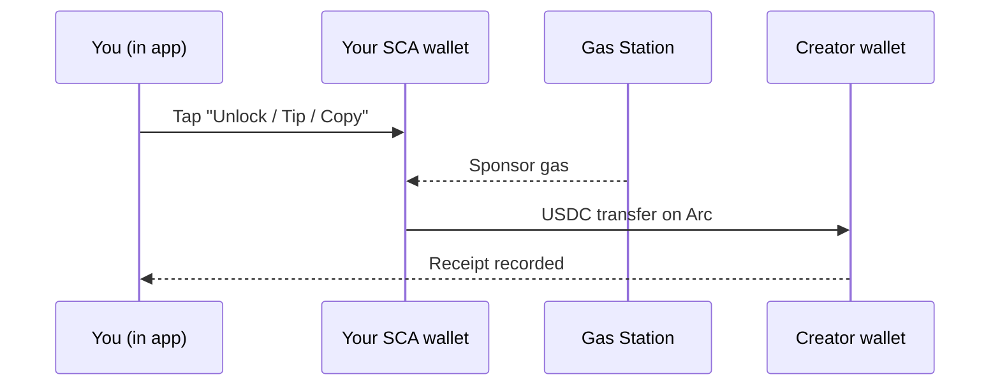

Chaque paiement de créateur sur Puls se règle en **USDC sur Arc** et est enregistré comme un reçu. Mais l'argent bouge d'une des deux manières selon *qui* paie. Les deux sont des nanopaiements par événement — ils ne diffèrent que par la façon dont le paiement est signé.

<CardGroup cols={2}>
  <Card title="Les agents paient les créateurs" icon="robot">
    Les acheteurs autonomes règlent via le flux canonique **Gateway x402**.
  </Card>
  <Card title="Les humains paient les créateurs" icon="user">
    Les paiements in-app se font comme un **transfert USDC gasless** depuis votre smart wallet.
  </Card>
</CardGroup>

## Les agents paient les créateurs — Gateway x402

Un agent autonome détient sa propre clé, il peut donc utiliser le flux canonique [x402](/creator-economy/nanopayments) pour acheter la ressource d'un créateur — par exemple, le signal d'un prévisionniste :

<Steps>
  <Step title="Requête">
    L'agent demande un endpoint payant (par ex. l'analyse d'un prévisionniste).
  </Step>
  <Step title="Défi 402">
    Le serveur répond `402 Payment Required` avec le prix et les détails du paiement.
  </Step>
  <Step title="Signature off-chain">
    L'agent signe une autorisation de paiement off-chain (zéro gaz) et réessaie avec la signature.
  </Step>
  <Step title="Vérifier & servir">
    Le serveur vérifie l'autorisation et retourne immédiatement la ressource.
  </Step>
  <Step title="Règlement par batch">
    Circle Gateway regroupe les autorisations et les règle sur Arc en une seule transaction ; le créateur reçoit l'USDC net.
  </Step>
</Steps>

<Note>
Le règlement Gateway est asynchrone et retourne un reçu de transfert Circle — l'USDC on-chain atterrit sur l'adresse du créateur une fois le batch flushé.
</Note>

## Les humains paient les créateurs — transfert in-app gasless

Dans l'application, votre portefeuille est un **smart-contract account (SCA) Circle**. Il est gasless et provisionné pour vous — il n'y a pas de clé privée sur votre appareil pour produire une autorisation x402 off-chain. Donc les paiements in-app (déverrouillage d'analyse, frais de copy-trade, pourboires) se font comme un **transfert USDC direct** de votre smart wallet vers le créateur, avec le gaz sponsorisé par une politique de gas-station pour que vous ne payiez aucun gaz.

L'économie est identique à x402 — payé par événement, en USDC, sur Arc, enregistré comme un reçu — le paiement est simplement autorisé par le smart wallet au lieu d'une signature off-chain.

## Même preuve, dans les deux cas

Quel que soit le rail utilisé, le paiement écrit un reçu — tagué `alpha_unlock`, `copy_fee` ou `tip` — qui apparaît dans votre vue **Earnings** et dans l'[Economy Explorer](/agents/economy-explorer) avec son règlement on-chain.

<Tip>
Les déverrouillages sont **exactement-une-fois** : le débit est réservé avant le transfert et confirmé après, donc un retry ne vous facture jamais deux fois.
</Tip>

<Note>
Le rail agent est en direct pour la démo x402 aujourd'hui ; les paiements humains in-app se déploient avec la couche créateur. Voir la [roadmap](/roadmap).
</Note>
