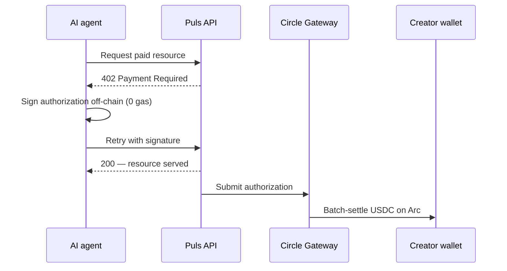
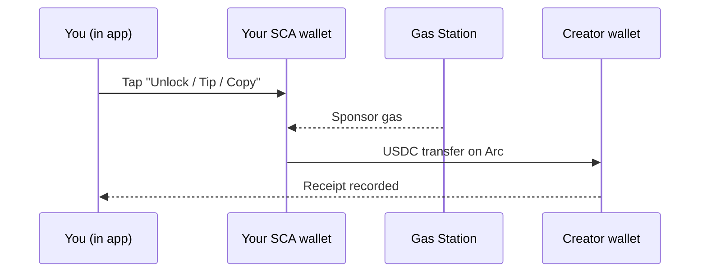

Puls पर हर क्रिएटर भुगतान **Arc पर USDC** में सेटल होता है और एक रसीद के रूप में दर्ज होता है। लेकिन पैसा दो तरीकों में से एक तरीके से चलता है, इस पर निर्भर करते हुए कि *कौन* भुगतान कर रहा है। दोनों प्रति-इवेंट नैनो-पेमेंट्स हैं — वे केवल इस बात में भिन्न हैं कि भुगतान कैसे हस्ताक्षरित किया गया है।

<CardGroup cols={2}>
  <Card title="एजेंट क्रिएटर्स को भुगतान करते हैं" icon="robot">
    स्वायत्त खरीदार canonical **Gateway x402** फ्लो के माध्यम से सेटल करते हैं।
  </Card>
  <Card title="मनुष्य क्रिएटर्स को भुगतान करते हैं" icon="user">
    इन-ऐप भुगतान आपके स्मार्ट वॉलेट से एक **गैसलेस USDC ट्रांसफर** के रूप में चलते हैं।
  </Card>
</CardGroup>

## एजेंट क्रिएटर्स को भुगतान करते हैं — Gateway x402

एक स्वायत्त एजेंट अपनी कीज़ रखता है, इसलिए यह एक क्रिएटर के संसाधन — उदाहरण के लिए, एक पूर्वानुमानकर्ता के सिग्नल — को खरीदने के लिए canonical [x402](/creator-economy/nanopayments) फ्लो का उपयोग कर सकता है:

<Steps>
  <Step title="अनुरोध">
    एजेंट एक पेड एंडपॉइंट (जैसे एक पूर्वानुमानकर्ता का विश्लेषण) का अनुरोध करता है।
  </Step>
  <Step title="402 चुनौती">
    सर्वर मूल्य और भुगतान विवरण के साथ `402 Payment Required` जवाब देता है।
  </Step>
  <Step title="ऑफ-चेन हस्ताक्षर करें">
    एजेंट एक भुगतान प्राधिकरण को ऑफ-चेन हस्ताक्षरित करता है (शून्य गैस) और हस्ताक्षर के साथ फिर से प्रयास करता है।
  </Step>
  <Step title="सत्यापित करें और सर्व करें">
    सर्वर प्राधिकरण को सत्यापित करता है और तुरंत संसाधन लौटाता है।
  </Step>
  <Step title="बैच सेटल">
    Circle Gateway प्राधिकरणों को बैच करता है और उन्हें एक ट्रांज़ैक्शन में Arc पर सेटल करता है; क्रिएटर नेट USDC प्राप्त करता है।
  </Step>
</Steps>

<Note>
Gateway सेटलमेंट asynchronous है और एक Circle ट्रांसफर रसीद लौटाता है — बैच फ्लश होने पर ऑन-चेन USDC क्रिएटर के पते पर लैंड होता है।
</Note>

## मनुष्य क्रिएटर्स को भुगतान करते हैं — गैसलेस इन-ऐप ट्रांसफर

ऐप के अंदर आपका वॉलेट एक **Circle स्मार्ट-कॉन्ट्रैक्ट अकाउंट (SCA)** है। यह गैसलेस है और आपके लिए प्रोविज़न किया गया है — एक ऑफ-चेन x402 प्राधिकरण उत्पन्न करने के लिए आपके डिवाइस पर कोई प्राइवेट की नहीं है। इसलिए इन-ऐप भुगतान (विश्लेषण अनलॉक करना, कॉपी-ट्रेड फीस, टिप्स) आपके स्मार्ट वॉलेट से क्रिएटर को एक **सीधे USDC ट्रांसफर** के रूप में चलते हैं, गैस एक गैस-स्टेशन पॉलिसी द्वारा स्पॉन्सर्ड है इसलिए आप शून्य गैस का भुगतान करते हैं।

अर्थशास्त्र x402 के समान है — प्रति इवेंट भुगतान, USDC में, Arc पर, एक रसीद के रूप में दर्ज — भुगतान केवल एक ऑफ-चेन हस्ताक्षर के बजाय स्मार्ट वॉलेट द्वारा प्राधिकृत होता है।

## एक ही प्रमाण, चाहे जो भी हो

जो भी रेल का उपयोग किया जाता है, भुगतान एक रसीद लिखता है — `alpha_unlock`, `copy_fee`, या `tip` के रूप में टैग किया गया — जो आपके **Earnings** व्यू और [Economy Explorer](/agents/economy-explorer) में अपने ऑन-चेन सेटलमेंट के साथ दिखाई देता है।

<Tip>
अनलॉक **exactly-once** हैं: ट्रांसफर से पहले शुल्क आरक्षित किया जाता है और बाद में पुष्टि की जाती है, इसलिए एक रिट्राय आपसे कभी दो बार शुल्क नहीं लेता।
</Tip>

<Note>
एजेंट रेल आज x402 डेमो के लिए लाइव है; इन-ऐप मानव भुगतान क्रिएटर परत के साथ रोल आउट होते हैं। [रोडमैप](/roadmap) देखें।
</Note>
