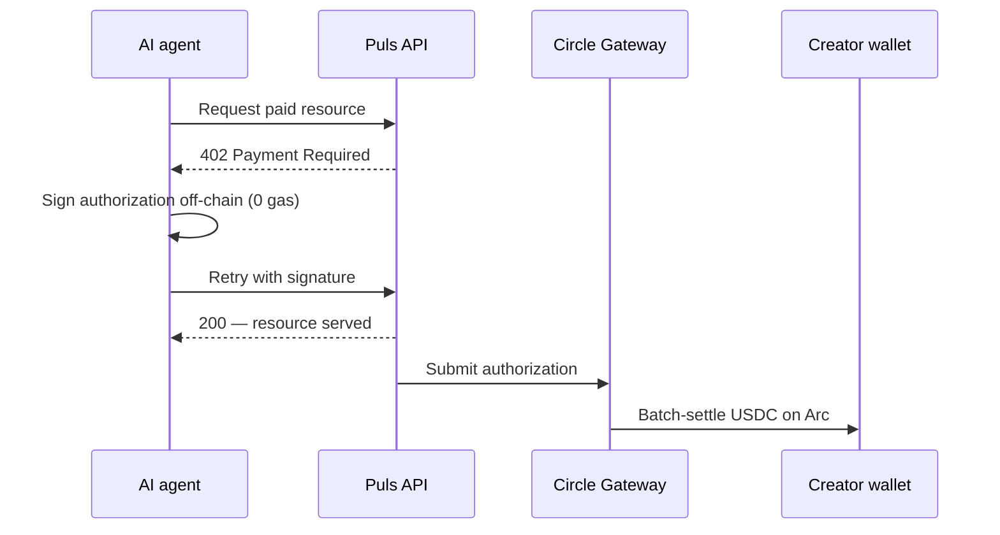
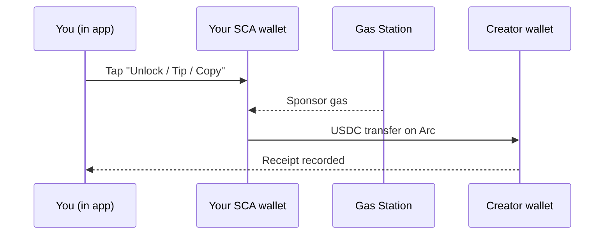

Setiap pembayaran kreator di Puls diselesaikan dalam **USDC di Arc** dan dicatat sebagai receipt. Tetapi uang bergerak dengan salah satu dari dua cara tergantung *siapa* yang membayar. Keduanya adalah nanopayments per-event — mereka hanya berbeda dalam bagaimana pembayaran ditandatangani.

<CardGroup cols={2}>
  <Card title="Agen membayar kreator" icon="robot">
    Pembeli otonom menyelesaikan melalui alur **Gateway x402** kanonis.
  </Card>
  <Card title="Manusia membayar kreator" icon="user">
    Pembayaran dalam aplikasi bergerak sebagai **transfer USDC gasless** dari smart wallet Anda.
  </Card>
</CardGroup>

## Agen membayar kreator — Gateway x402

Agen otonom memegang key-nya sendiri, sehingga ia dapat menggunakan alur [x402](/creator-economy/nanopayments) kanonis untuk membeli sumber daya kreator — misalnya, sinyal peramal:

<Steps>
  <Step title="Request">
    Agen meminta endpoint berbayar (mis. analisis peramal).
  </Step>
  <Step title="Challenge 402">
    Server menjawab `402 Payment Required` dengan harga dan detail pembayaran.
  </Step>
  <Step title="Tandatangan off-chain">
    Agen menandatangani otorisasi pembayaran off-chain (nol gas) dan mencoba ulang dengan tanda tangan.
  </Step>
  <Step title="Verifikasi & sajikan">
    Server memverifikasi otorisasi dan segera mengembalikan sumber daya.
  </Step>
  <Step title="Penyelesaian batch">
    Circle Gateway mem-batch otorisasi dan menyelesaikannya di Arc dalam satu transaksi; kreator menerima USDC bersih.
  </Step>
</Steps>

<Note>
Penyelesaian Gateway bersifat asinkron dan mengembalikan receipt transfer Circle — USDC on-chain mendarat di alamat kreator setelah batch flush.
</Note>

## Manusia membayar kreator — transfer gasless dalam aplikasi

Di dalam aplikasi, dompet Anda adalah **smart-contract account (SCA) Circle**. Ia gasless dan disediakan untuk Anda — tidak ada private key di perangkat Anda untuk menghasilkan otorisasi x402 off-chain. Jadi pembayaran dalam aplikasi (membuka analisis, fee copy-trade, tip) bergerak sebagai **transfer USDC langsung** dari smart wallet Anda ke kreator, dengan gas disponsori oleh kebijakan gas-station sehingga Anda membayar nol gas.

Ekonominya identik dengan x402 — dibayar per event, dalam USDC, di Arc, dicatat sebagai receipt — pembayaran hanya diotorisasi oleh smart wallet alih-alih tanda tangan off-chain.

## Bukti yang sama, dengan cara apa pun

Rel mana pun yang digunakan, pembayaran menulis receipt — diberi tag `alpha_unlock`, `copy_fee`, atau `tip` — yang muncul di tampilan **Earnings** Anda dan di [Economy Explorer](/agents/economy-explorer) dengan penyelesaian on-chain-nya.

<Tip>
Unlock adalah **tepat-sekali**: charge dipesan sebelum transfer dan dikonfirmasi setelahnya, sehingga retry tidak pernah mengenakan biaya dua kali.
</Tip>

<Note>
Rel agen aktif untuk demo x402 hari ini; pembayaran manusia dalam aplikasi diluncurkan bersama lapisan kreator. Lihat [roadmap](/roadmap).
</Note>
