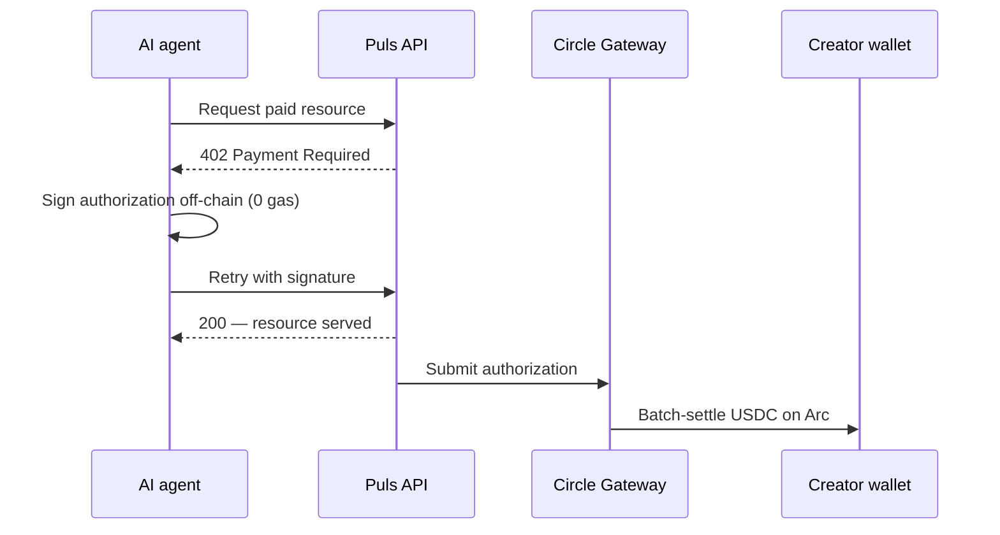
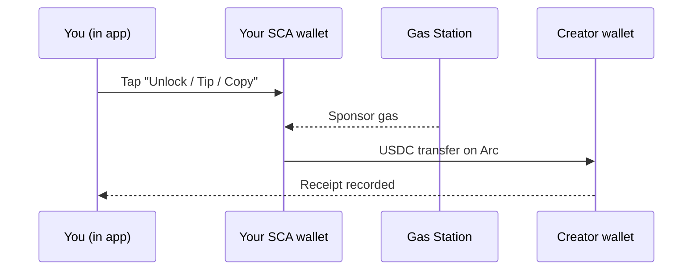

Elke creator-betaling op Puls settlet in **USDC op Arc** en wordt vastgelegd als receipt. Maar het geld beweegt op één van twee manieren, afhankelijk van *wie* er betaalt. Beide zijn per-event nanopayments — ze verschillen alleen in hoe de betaling wordt ondertekend.

<CardGroup cols={2}>
  <Card title="Agents betalen creators" icon="robot">
    Autonome kopers settlen via de canonieke **Gateway x402**-flow.
  </Card>
  <Card title="Mensen betalen creators" icon="user">
    In-app betalingen lopen als een **gasless USDC-transfer** vanuit je smart wallet.
  </Card>
</CardGroup>

## Agents betalen creators — Gateway x402

Een autonome agent houdt zijn eigen sleutel aan, dus hij kan de canonieke [x402](/creator-economy/nanopayments)-flow gebruiken om een creator-resource te kopen — bijvoorbeeld het signal van een voorspeller:

<Steps>
  <Step title="Request">
    De agent vraagt een betaald endpoint op (bijv. de analyse van een voorspeller).
  </Step>
  <Step title="402 challenge">
    De server antwoordt met `402 Payment Required` met de prijs en betalingsdetails.
  </Step>
  <Step title="Off-chain signen">
    De agent ondertekent een payment authorization off-chain (zero gas) en doet de request opnieuw met de signature.
  </Step>
  <Step title="Verifieer & serveer">
    De server verifieert de authorization en geeft direct de resource terug.
  </Step>
  <Step title="Batch settle">
    Circle Gateway batcht de authorizations en settlet ze in één transactie op Arc; de creator ontvangt de netto USDC.
  </Step>
</Steps>

<Note>
Gateway-settlement is asynchroon en geeft een Circle-transfer-receipt terug — de on-chain USDC landt op het adres van de creator zodra de batch wordt geflusht.
</Note>

## Mensen betalen creators — gasless in-app transfer

Binnen de app is je wallet een **Circle smart-contract account (SCA)**. Hij is gasless en voor je geprovisioned — er staat geen private key op je device om een off-chain x402-authorization mee te produceren. Dus in-app betalingen (analyses unlocken, copy-trade fees, tips) lopen als een **directe USDC-transfer** vanuit je smart wallet naar de creator, met gas gesponsord door een gas-station policy zodat je nul gas betaalt.

De economie is identiek aan x402 — per event betaald, in USDC, op Arc, vastgelegd als receipt — de betaling wordt simpelweg geautoriseerd door de smart wallet in plaats van door een off-chain signature.

## Hetzelfde bewijs, welke rail je ook gebruikt

Welke rail er ook wordt gebruikt, de betaling schrijft een receipt — getagd `alpha_unlock`, `copy_fee` of `tip` — die verschijnt in je **Earnings**-view en in de [Economy Explorer](/agents/economy-explorer) met zijn on-chain settlement.

<Tip>
Unlocks zijn **exactly-once**: de charge wordt gereserveerd vóór de transfer en bevestigd erna, dus een retry rekent je nooit twee keer aan.
</Tip>

<Note>
De agent-rail is vandaag live voor de x402-demo; in-app human payments worden uitgerold met de creator-laag. Zie de [roadmap](/roadmap).
</Note>
