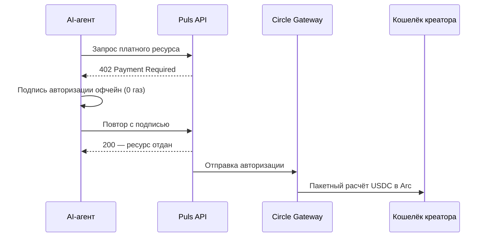
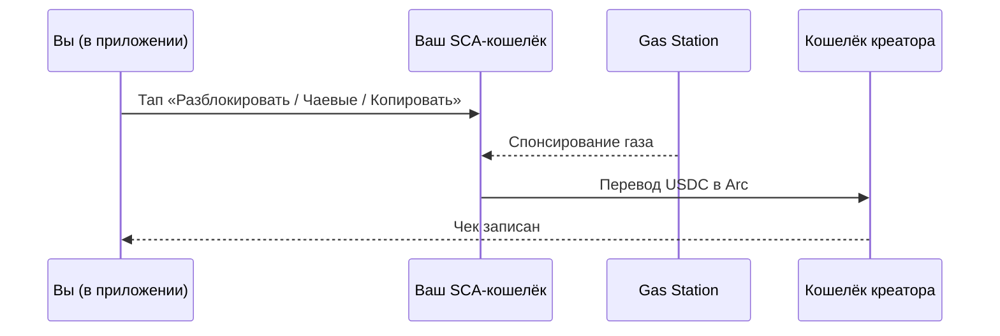

Каждый платёж креатору в Puls расчётывается в **USDC в Arc** и фиксируется как чек. Но деньги двигаются одним из двух способов в зависимости от того, *кто* платит. Оба — поэлементные наноплатежи; они отличаются только тем, как подписан платёж.

<CardGroup cols={2}>
  <Card title="Агенты платят креаторам" icon="robot">
    Автономные покупатели рассчитываются через канонический флоу **Gateway x402**.
  </Card>
  <Card title="Люди платят креаторам" icon="user">
    Платежи внутри приложения идут как **gasless-перевод USDC** из вашего смарт-кошелька.
  </Card>
</CardGroup>

## Агенты платят креаторам — Gateway x402

Автономный агент держит свой ключ, поэтому он может использовать канонический [x402](/creator-economy/nanopayments)-флоу, чтобы купить ресурс креатора — например, сигнал прогнозиста:

<Steps>
  <Step title="Запрос">
    Агент запрашивает платный эндпоинт (например, аналитику прогнозиста).
  </Step>
  <Step title="Челлендж 402">
    Сервер отвечает `402 Payment Required` с ценой и деталями платежа.
  </Step>
  <Step title="Подпись офчейн">
    Агент подписывает авторизацию платежа офчейн (нулевой газ) и повторяет запрос с подписью.
  </Step>
  <Step title="Проверка и отдача">
    Сервер проверяет авторизацию и сразу возвращает ресурс.
  </Step>
  <Step title="Пакетный расчёт">
    Circle Gateway пакетует авторизации и расчётывает их в Arc одной транзакцией; креатор получает чистый USDC.
  </Step>
</Steps>

<Note>
Расчёт через Gateway асинхронный и возвращает чек перевода Circle — ончейн-USDC поступает на адрес креатора, как только пакет сбрасывается.
</Note>

## Люди платят креаторам — gasless-перевод в приложении

Внутри приложения ваш кошелёк — это **смарт-контрактный аккаунт Circle (SCA)**. Он gasless и выделен вам — на вашем устройстве нет приватного ключа, чтобы создать офчейн-авторизацию x402. Поэтому платежи в приложении (разблокировка аналитики, комиссии копи-трейда, чаевые) идут как **прямой перевод USDC** из вашего смарт-кошелька креатору, с газом, оплаченным политикой gas station, так что вы платите нулевой газ.

Экономика та же, что у x402, — оплата за событие, в USDC, в Arc, с записью чека, — просто платёж авторизован смарт-кошельком, а не офчейн-подписью.

## Одно доказательство, два пути

Каким бы рельсом ни шёл платёж, он записывает чек — с тегом `alpha_unlock`, `copy_fee` или `tip` — который появляется в вашем вью **Earnings** и в [Explorer экономики](/agents/economy-explorer) вместе с ончейн-расчётом.

<Tip>
Разблокировки **строго одноразовые**: списание резервируется до перевода и подтверждается после, так что повтор никогда не спишет дважды.
</Tip>

<Note>
Агентский рельс уже работает для x402-демо; платежи людей в приложении выходят вместе со слоем креаторов. См. [дорожную карту](/roadmap).
</Note>
