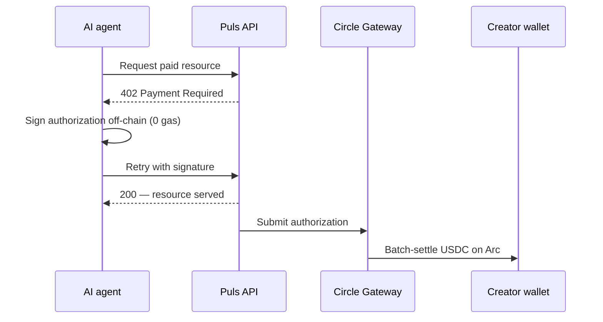
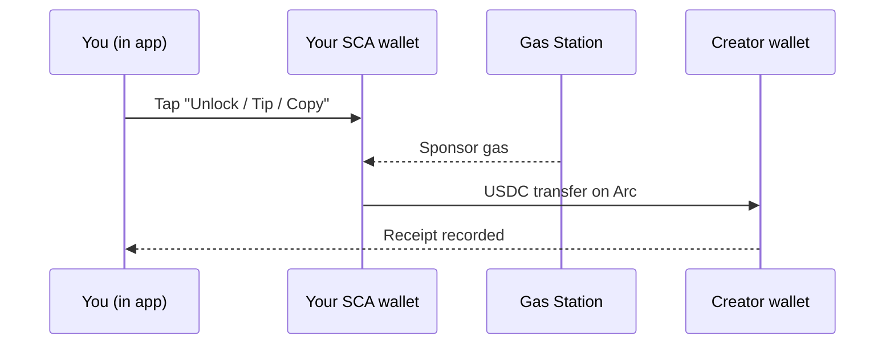

Mọi thanh toán creator trên Puls đều thanh toán bằng **USDC trên Arc** và được ghi nhận như một biên lai. Nhưng tiền di chuyển theo một trong hai cách tùy thuộc vào *ai* đang trả. Cả hai đều là nanopayment theo sự kiện — chỉ khác ở cách thanh toán được ký.

<CardGroup cols={2}>
  <Card title="Agent trả tiền cho creator" icon="robot">
    Người mua tự chủ thanh toán qua luồng **Gateway x402** chính tắc.
  </Card>
  <Card title="Con người trả tiền cho creator" icon="user">
    Thanh toán trong ứng dụng di chuyển dưới dạng **chuyển USDC gasless** từ ví smart của bạn.
  </Card>
</CardGroup>

## Agent trả tiền cho creator — Gateway x402

Một agent tự chủ giữ khóa riêng, vì vậy nó có thể sử dụng luồng [x402](/creator-economy/nanopayments) chính tắc để mua tài nguyên của creator — ví dụ, signal của một nhà dự báo:

<Steps>
  <Step title="Yêu cầu">
    Agent yêu cầu một endpoint trả phí (ví dụ, phân tích của nhà dự báo).
  </Step>
  <Step title="Thách thức 402">
    Server đáp `402 Payment Required` với giá và chi tiết thanh toán.
  </Step>
  <Step title="Ký off-chain">
    Agent ký ủy quyền thanh toán off-chain (không gas) và thử lại với chữ ký.
  </Step>
  <Step title="Xác minh & phục vụ">
    Server xác minh ủy quyền và ngay lập tức trả tài nguyên.
  </Step>
  <Step title="Thanh toán theo lô">
    Circle Gateway gộp các ủy quyền và thanh toán trên Arc trong một giao dịch; creator nhận USDC ròng.
  </Step>
</Steps>

<Note>
Thanh toán Gateway là bất đồng bộ và trả một biên lai chuyển khoản Circle — USDC on-chain đến địa chỉ của creator khi lô được xả.
</Note>

## Con người trả tiền cho creator — chuyển khoản gasless trong ứng dụng

Bên trong ứng dụng, ví của bạn là một **tài khoản smart-contract Circle (SCA)**. Nó là gasless và được cấp phát cho bạn — không có khóa riêng trên thiết bị của bạn để tạo ủy quyền x402 off-chain. Vì vậy các thanh toán trong ứng dụng (mở khóa phân tích, phí copy-trade, tips) di chuyển dưới dạng **chuyển USDC trực tiếp** từ ví smart của bạn đến creator, với gas được tài trợ bởi chính sách gas-station nên bạn trả không gas.

Kinh tế giống hệt x402 — trả theo sự kiện, bằng USDC, trên Arc, ghi nhận như biên lai — thanh toán đơn giản được ủy quyền bởi ví smart thay vì chữ ký off-chain.

## Cùng bằng chứng, theo cách nào cũng vậy

Đường ray nào được sử dụng, thanh toán đều ghi một biên lai — gắn nhãn `alpha_unlock`, `copy_fee`, hoặc `tip` — xuất hiện trong view **Earnings** và trong [Economy Explorer](/agents/economy-explorer) cùng thanh toán on-chain.

<Tip>
Các lượt mở khóa là **đúng một lần**: phí được giữ trước khi chuyển và xác nhận sau, vì vậy thử lại không bao giờ tính phí bạn hai lần.
</Tip>

<Note>
Đường ray agent đang hoạt động cho demo x402 hôm nay; thanh toán trong ứng dụng cho con người triển khai cùng lớp creator. Xem [lộ trình](/roadmap).
</Note>
